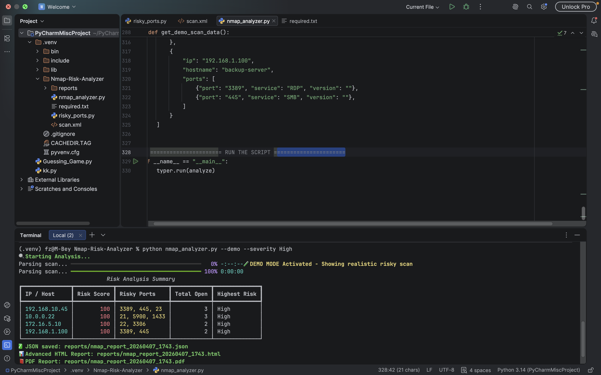

# AI-security-nmap-analyzer

**Nmap Scan Analyzer & Risk Reporter** Turns raw Nmap output into prioritized, actionable security intelligence with risk scoring, interactive dashboards, and professional reports.

Built during my transition from SOC Analyst to AI Security Engineer.


### 1. Problem Statement

Security teams and red teams run Nmap scans every day, but raw XML or grepable output is hard to digest. High-risk services like RDP, SMB, Telnet, or outdated SSH versions often get buried among hundreds or thousands of ports and hosts, leaving critical exposures unnoticed.

**Real-World Scenario:**  
A mid-sized company notices repeated failed RDP login attempts on a key server and an exposed SMB service with known vulnerabilities. The analysts receive the latest Nmap scan, but it’s just a massive XML file. By the time they manually sift through it, attackers may have already escalated privileges or exfiltrated sensitive data. This delay increases the company’s attack surface and prolongs remediation time.

This tool transforms raw Nmap output into actionable intelligence, highlighting the riskiest services immediately so analysts can respond before attackers exploit weaknesses.

### 2. Business / Security Value

- **Saves analysts hours**: Prioritizes dangerous exposures so SOC teams don’t drown in data.
- **Reduces MTTR (Mean Time to Remediate)**: Critical risks are flagged instantly for faster action.
- **Professional reporting**: Generates JSON, interactive HTML dashboards, and PDF reports for vulnerability management and leadership.
- **Supports proactive defense**: Perfect for internal pentests, quarterly audits, and post-breach investigations where every second is very important.

### 3. How It Works

1. **Run your Nmap scan**  
   Security teams perform a standard Nmap scan (`-oX` or `-oG`) against internal or external assets.

2. **Feed the scan into the analyzer**  
   Instead of manually parsing XML, analysts provide the scan file to the tool. The analyzer immediately processes thousands of lines of raw data.

3. **Get prioritized, actionable insights**  
   - **Terminal summary**: Shows high-risk services first, with a weighted risk score.  
   - **Interactive HTML dashboard**: Sortable table + Chart.js bar chart to visualize risk at a glance.  
   - **PDF report for stakeholders**: Clean, professional document ready to share with management.


https://github.com/Muhammad-cyber-mujahid/Nmap-Security-Analyzer.git


### 4. Current Limitations

- Risk scoring is currently static (based on service type, port exposure, and known dangerous protocols/version).
- Does not yet factor in asset criticality or business impact.
- PDF generation requires Playwright and Chromium.

### 5. Future Roadmap / AI Security Angle

- Integrate with Project 0 (CVE Hunter) to automatically map open services to the latest CVEs.


### Screenshots

*Rich terminal summary with risk scores*


### Installation & Usage (Step-by-Step Guide)

#### Hardware Requirements
- Laptop or desktop (Windows, macOS, or Linux)
- 4 GB RAM minimum (8 GB recommended for PDF generation)
- Python 3.11 or higher
- Nmap installed (`sudo apt install nmap` on Linux, or use official installer)

#### Step 1: Clone & Setup
```bash
git clone https://github.com/YOUR-USERNAME/ai-sec-nmap-analyzer.git
cd ai-sec-nmap-analyzer
pip install -r requirements.txt
playwright install chromium   # One-time only


Step 2: Run a Sample Scan
Bash

nmap -sV -O -oX data/sample_scan.xml 192.168.1.0/24


Step 3: Analyze the Scan
Bash

python -m src.nmap_analyzer analyze --file data/sample_scan.xml --severity High --output audit_report


Example CLI Usage:
Bash

# Basic usage
python -m src.nmap_analyzer analyze -f scan.xml -s High

# With custom output name
python -m src.nmap_analyzer analyze -f internal_scan.xml -s Critical -o quarterly_audit


You will get:
	•	Beautiful terminal table with risk scores
	•	JSON report
	•	Interactive HTML dashboard (with chart)
	•	Professional PDF report

Tech Stack
	•	Python 3.11+
	•	Typer + Rich (CLI & beautiful terminal)
	•	defusedxml (secure parsing)
	•	Jinja2 + Chart.js (HTML report)
	•	Playwright (PDF export)

Made with ❤️ by Muhammad Shitta-Bey
Part of my journey from SOC Analyst to AI Security Engineer.


